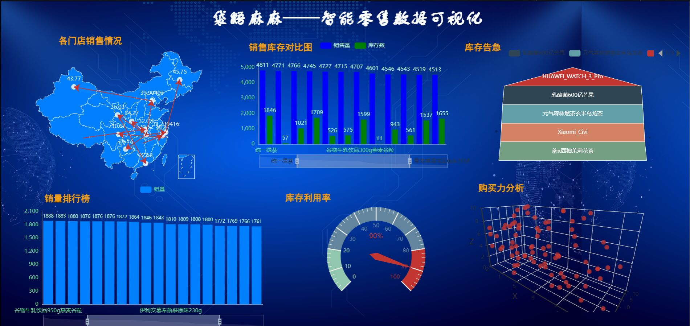

<div align="center">

</div>  
 
<h1 > 袋鼯麻麻——智能零售结算平台</h1>


-pink.svg)

- [gitee 支持国产](https://gitee.com/E_Light/Smart_container)
- [github](https://github.com/thomas-yanxin/Smart_container)
> 求求了，点个Star吧

## 😉近期更新😉

-  **文档全面升级**：提供[PP-ShiTu模型训练及部署详细文档](https://github.com/thomas-yanxin/Smart_container/blob/master/docs/readme_industry_v5.md)；
-  **部署方式优化**：预测速度提升**65**%，基于CPU整体流程控制在**0.9s**左右； 
-  **产品功能升级**：增加库存信息管理功能，提供一键式数据可视化分析平台。

## 🧁项目背景🧁
<font size=3 >目前在零售行业的实际运营过程中，会产生巨大的人力成本，例如导购、保洁、结算等，而其中，尤其需要花费大量的人力成本和时间成本在识别商品并对其进行价格结算的过程中，并且在此过程中，顾客也因此而需要排队等待。这样一来零售行业人力成本较大、工作效率极低，二来也使得顾客的购物体验下降。  
  
随着计算机视觉技术的发展，以及无人化、自动化超市运营理念的提出，利用图像识别技术及目标检测技术实现产品的自动识别及自动化结算的需求呼之欲出，即自动结账系统（Automatic checkout, ACO）。基于计算机视觉的自动结账系统能有效降低零售行业的运营成本，提高顾客结账效率，从而进一步提升用户在购物过程中的体验感与幸福感。  </font>

## 适用场景  

 >**袋鼯麻麻——智能零售结算平台**致力于为**大型线下零售体验店**提供基于视觉的零售结算方案。

## 痛点问题

   1. **结算效率要求极高**：在大型线下零售体验店购物场景中，若顾客购买的商品较多，采用传统的条形码结算，效率较低，顾客购物体验较差；
   2. **品类更新极快**：像新零售这种行业，新品几乎都是**按小时级别**在更新，每增加新的产品都要辛辛苦苦重新训练模型，仅靠单一模型想要跟上步伐，着实望尘莫及；
   3. **不同商品相似度极高**：比如同一种饮料的不同口味，就很可能拥有非常类似的包装。而且即便对于同一件商品，**在不同情况下所获得的商品图像都往往存在相当大的差异**；
   4. **商品类别数以万计**：根本没法事先把所有类别都放入训练集。

## 🍑实现功能🍑
<font size=3 >“**袋鼯麻麻——智能零售结算平台**”具体实现在零售过程中对用户购买商品的自动结算。即：利用PaddleClas团队开源的[图像识别PP-ShiTu](https://arxiv.org/pdf/2111.00775.pdf)技术，精准地定位顾客购买的商品，并进行智能化、自动化的价格结算。当顾客将自己选购的商品放置在制定区域内时，“**袋鼯麻麻——智能零售结算平台**”能够精准地定位识别每一个商品，并且能够返回完整的购物清单及顾客应付的实际商品总价格。而当系统有新商品增加时，本系统只需更新检索库即可，无需重新训练模型。   
    
  本项目为轻量级通用图像识别系统PP-ShiTu提供了扎实的落地应用案例，对新零售行业中无人零售视觉化智能解决方案提供了非常好的基础和思路，尤其针对解决多类别、小样本、高相似和更新频繁的特殊图像识别场景痛难点提供了可参考的示范，极大地降低零售行业实际运营过程中巨大的人力成本，提升零售行业无人化、自动化、智能化水平。  </font>  

<div align="center">

</div>


## 🍎整体架构🍎
<div align="center">

</div>


## 🐻技术路线🐻
<font size=3 >**袋鼯麻麻——智能零售结算平台** 基于[PaddleClas](https://github.com/PaddlePaddle/PaddleClas)作为主要的功能开发套件，利用其开源的[PP-ShiTu](https://arxiv.org/pdf/2111.00775.pdf)进行核心功能的开发，并通过PaddleInference将其部署于Jetson Nano，并基于[QPT](https://github.com/QPT-Family/QPT)打包.exe打通Windows系统，开发一套符合实际应用需求的工业级智能零售结算平台。  </font>

### [图像识别PP-ShiTu](https://arxiv.org/pdf/2111.00775.pdf)介绍

PP-ShiTu是一个实用的轻量级通用图像识别系统，主要由主体检测、特征学习和向量检索三个模块组成。该系统从骨干网络选择和调整、损失函数的选择、数据增强、学习率变换策略、正则化参数选择、预训练模型使用以及模型裁剪量化8个方面，采用多种策略，对各个模块的模型进行优化，最终得到在CPU上仅0.2s即可完成10w+库的图像识别的系统。

<div align="center">

</div>

<font size=3 >整个图像识别系统分为三步（[详情见PP-ShiTu训练模块](https://github.com/PaddlePaddle/PaddleClas/blob/release/2.3/docs/zh_CN/models_training/recognition.md)）：  
（1）通过一个目标检测模型，检测图像物体候选区域；  
（2）对每个候选区域进行特征提取；  
（3）与检索库中图像进行特征匹配，提取识别结果。

对于新的未知类别，无需重新训练模型，只需要在检索库补入该类别图像，重新建立检索库，就可以识别该类别。  </font>

### 数据集介绍
【The first one】:[Products-10K Large Scale Product Recognition Dataset](https://arxiv.org/abs/2006.12634)  

【The second one】:[RP2K: A Large-Scale Retail Product Dataset for Fine-Grained Image Classification](https://www.pinlandata.com/rp2k_dataset)  

**袋鼯麻麻——智能购物平台**基于上述两个数据集，结合爬虫，对此两种数据集进行适应性处理。  

### 商品部分list

> 	东古酱油一品鲜  
	东古黄豆酱750G  
	东鹏特饮罐装  
	中华（硬）  
	中华（软）  
	乳酸菌600亿_2  
	乳酸菌600亿_3  
	乳酸菌600亿原味  
	乳酸菌600亿芒果  
	乳酸菌600亿芦荟  
   ...


目前处理后的数据集已在[AIStudio](https://aistudio.baidu.com/aistudio/datasetdetail/113685)开源。 </font>


## 🌍部署方式🌍
本项目已打通**Jetson Nano、Windows、linux**系统  

<font size=3 >
  
  - Windows 端  
  <本项目提供了较为简单的demo演示版本>
    使用[QPT](https://github.com/QPT-Family/QPT)打包   
    链接：https://pan.baidu.com/s/194ApbJuDJWyV7tv5sCaGsg  提取码：wy7i  
	  
	  解压后运行**启动程序.exe**即可
  - Linux 端  
    Download本项目代码后，进入client文件夹内，执行以下代码即可运行：
    ```
      python client.py
     ```
  
  - 图像识别部分部署详情请见[PP-ShiTu部署](https://github.com/PaddlePaddle/PaddleClas/blob/release/2.3/docs/zh_CN/inference_deployment/python_deploy.md#%E4%B8%BB%E4%BD%93%E6%A3%80%E6%B5%8B%E3%80%81%E7%89%B9%E5%BE%81%E6%8F%90%E5%8F%96%E5%92%8C%E5%90%91%E9%87%8F%E6%A3%80%E7%B4%A2%E4%B8%B2%E8%81%94)
  
  - 微信小程序端
   打开微信开发者工具，导入系统文件夹下AIContainer文件夹并运行，即可运行小程序端；

## 💃[bilibili](https://www.bilibili.com/video/BV19q4y1G7bx#reply5654379507)效果演示💃  
 
    
- 主界面
  <div align="center"></div>
  
- 端侧界面  
 
<div align="center"></div>


- 小程序界面
  <div align="center">

</div>

- 大数据可视化分析界面
	<div align="center">

</div>  


## ⛽️待完成⛽️

  
 |  序号  | 完成度 |  优先级 |  分属类别  |  功能描述  | 
 | :----: | :---- | :---- | :---- | :---- |
 |  1  |  已完成  |★★★★★  | 小程序 | ~~添加库存信息显示，增添数据分析模块~~|
 |  2  |  在做了  |★★★★★  | 小程序 |  初始功能上线  |
 |  3  |  已完成  |★★★★★  | 端侧 |   ~~Jetson Nano的深度适配~~  |
 |  4  |  规划中  |★★★★  | 小程序 |  面向管理者及顾客的功能分离  |
 |  5  |  已完成  |★★★★  | web |   ~~基于 [Tyadmin](https://github.com/mtianyan/django-antd-tyadmin) or 其他工具 关于web端信息管理系统的建立~~  |
 |  6  |  规划中  |★★★  | 小程序 |  接入[PaddleOCR](https://github.com/PaddlePaddle/PaddleOCR)实现商品名称的自动录入  |
 |  7  |  规划中  |★★  | APP |  Android and IOS 客户端的打通部署  |


## 🚀开发团队🚀

  |  职责   |  名单  |
|  :----:  | :----:  |
| PM | [颜鑫](https://github.com/thomas-yanxin) |
| 算法 | [颜鑫](https://github.com/thomas-yanxin) |
| 端侧前端 | [颜鑫](https://github.com/thomas-yanxin) |
| 小程序前端  | [沈晨](https://github.com/Scxw010516) |
 | 后端  | [杜旭东](https://github.com/DXD-agumo) |
  
## ☕来一杯咖啡☕
一杯咖啡提神醒脑，产品更新会更快更好！  
<div></div>
	  
## 🌟特别鸣谢🌟
  - [PaddleClas](https://github.com/PaddlePaddle/PaddleClas) 提供了图像识别核心功能开发；
  - [QPT打包工具](https://github.com/QPT-Family/QPT) 提供了Windows端.exe打包；

## ❤️欢迎共建❤️
  我们非常欢迎您为"**袋鼯麻麻——智能零售结算平台**"贡献代码或者提供使用建议。无论您是提出存在bug、修复某个bug或者增加一个新功能，欢迎给我们提交issue or Pull Requests。

