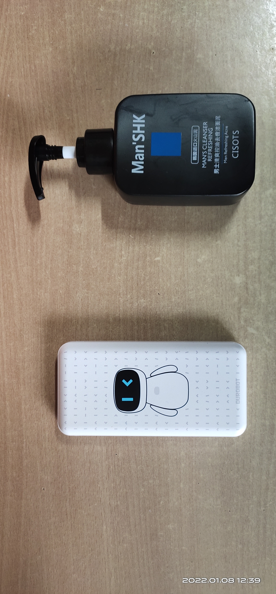

 # 智慧商超商品识别方案

## 项目介绍

### 背景简介

   目前，在传统的商超零售企业的经营过程中，急需通过引进数字化及人工智能等新兴技术，进行管理能力、成本控制、用户体验等多维度的全面升级。而现如今普遍通用的人工智能技术并不能帮助零售企业从根本上上述问腿。  
     
     
   传统商超零售企业数字化转型陷入两难境地。   
 
<!-- <div style="align: center">

</div> -->

### 痛点问题

   1. **结算效率要求极高**：在商超零售场景中，若顾客购买的商品较多，采用传统的条形码结算，效率较低，顾客购物体验较差；
   2. **不同商品相似度极高**：比如同一种饮料的不同口味，就很可能拥有非常类似的包装。而且即便对于同一件商品，**在不同情况下所获得的商品图像都往往存在相当大的差异**；
   3. **品类更新极快**：商超零售场景下，新品通常以**小时级别**速度更新迭代，每增加新产品时若仅靠单一模型均需重新训练模型，模型训练成本及时间成本极大。

### 解决方案

   PaddleClas团队开源的[图像识别PP-ShiTu](https://arxiv.org/pdf/2111.00775.pdf)技术方案，主要由主体检测、特征学习和向量检索三个模块组成，是一个实用的轻量级通用图像识别系统。基于此技术方案，商超零售企业可实现大量商品的一键式智能化识别，大大提高识别效率，节省人工及时间成本。  
     
     
   此外，当新品迭代更新时，PP-shitu无需重新训练模型，能够做到“即增即用”，完美解决上述痛点问题，大大提高了人工智能在商超零售行业的应用落地可能性。   
   
   PP-shitu技术方案可具体应用于例如：商品结算、库存管理等关于商品识别的商超细分场景。

### 模型工具简介

   飞桨图像识别套件PaddleClas是飞桨为工业界和学术界所准备的一个图像识别任务的工具集，助力使用者训练出更好的视觉模型和应用落地。  

   而[PP-ShiTu](https://arxiv.org/pdf/2111.00775.pdf)是一个实用的轻量级通用图像识别系统，主要由主体检测、特征学习和向量检索三个模块组成。该系统从骨干网络选择和调整、损失函数的选择、数据增强、学习率变换策略、正则化参数选择、预训练模型使用以及模型裁剪量化8个方面，采用多种策略，对各个模块的模型进行优化，最终得到在CPU上仅0.2s即可完成10w+库的图像识别的系统。

## 安装说明

### 环境要求
- Python >= 3.6
- PaddlePaddle >= 2.1
- Linux 环境最佳

- 安装PaddleClas

    - 克隆 PaddleClas
    ```shell
    git clone https://github.com/PaddlePaddle/PaddleClas.git -b release/2.3
    ```
    - 安装 Python 依赖库  
    PaddleClas 的 Python 依赖库在 `requirements.txt` 中给出，可通过如下命令安装：
    ```shell
    pip install --upgrade -r requirements.txt -i https://mirror.baidu.com/pypi/simple


```python
!git clone https://github.com/PaddlePaddle/PaddleClas.git -b release/2.3
```


```python
%cd PaddleClas/
!pip install --upgrade -r requirements.txt -i https://mirror.baidu.com/pypi/simple
```

## 数据准备

### 数据集介绍<详细讲述>

1. 目前开源的商品识别方向的数据集

- [Products-10K Large Scale Product Recognition Dataset](https://www.kaggle.com/c/products-10k/data?select=train.csv) :数据集中的所有图片均来自京东商城。数据集中共包含 1 万个经常购买的 SKU。所有 SKU 组织成一个层次结构。总共有近 19 万张图片。在实际应用场景中，图像量的分布是不均衡的。所有图像都由生产专家团队手工检查/标记。

- [RP2K: A Large-Scale Retail Product Dataset for Fine-Grained Image Classification](https://arxiv.org/abs/2006.12634) :收集了超过 500,000 张货架上零售产品的图像，属于 2000 种不同的产品。所有图片均在实体零售店人工拍摄，自然采光，符合实际应用场景。

2. 本项目**以实际应用场景为依托，以数据质量为主要衡量标准**，主体基于上述开源商品识别方向数据集、结合图片爬虫技术等数据搜索方式，开源了一份更符合本项目实际应用背景的[demo数据集](https://aistudio.baidu.com/aistudio/datasetdetail/113685)。此数据集总计覆盖商品**357类**，涵盖包括厨房用品、日用品、饮料等**生活日常购买商品**，商品类别**细粒度较高**，涉及诸如**同一品牌的不同规格商品**、**同一品类的不同品牌商品**等实际场景下的数据可能性，能够模拟实际购物场景下的购买需求。

### 商品部分list

> 	东古酱油一品鲜  
	东古黄豆酱750G  
	东鹏特饮罐装  
	中华（硬）  
	中华（软）  
	乳酸菌600亿_2  
	乳酸菌600亿_3  
	乳酸菌600亿原味  
	乳酸菌600亿芒果  
	乳酸菌600亿芦荟  
   ...
   
### 数据集格式
* 训练集合（train dataset）：用来训练模型，使模型能够学习该集合的图像特征。
* 底库数据集合（gallery dataset）：用来提供图像检索任务中的底库数据，该集合可与训练集或测试集相同，也可以不同，当与训练集相同时，测试集的类别体系应与训练集的类别体系相同。
* 测试数据集合（query dataset）：用来测试模型的好坏，通常要对测试集的每一张测试图片进行特征提取，之后和底库数据的特征进行距离匹配，得到识别结果，后根据识别结果计算整个测试集的指标。

训练集、底库数据集和测试数据集均使用 `txt` 文件指定，训练数据集 `train_list.txt`文件内容格式如下所示：

```shell
# 采用"空格"作为分隔符号
...
train/10/1283.jpg 10 624
train/10/1284.jpg 10 625
train/10/1285.jpg 10 626
train/10/1286.jpg 10 627
...
```
验证数据集(本数据集中既是 gallery dataset，也是 query dataset)test_list.txt 文件内容格式如下所示：
```shell
...
test/103/743.jpg 103 743
test/103/744.jpg 103 744
test/103/745.jpg 103 745
test/103/746.jpg 103 746
...
```

**注：**
1. 每行数据使用“空格”分割，三列数据的含义分别是训练数据的路径、训练数据的label信息、训练数据的unique id;
2. 本数据集中由于 gallery dataset 和 query dataset 相同，为了去掉检索得到的第一个数据（检索图片本身无须评估），每个数据需要对应一个 unique id（每张图片的 id 不同即可，可以用行号来表示 unique id），用于后续评测 mAP、recall@1 等指标。yaml 配置文件的数据集选用 VeriWild。

## 模型选择

PP-ShiTu是一个实用的轻量级通用图像识别系统，主要由主体检测、特征学习和向量检索三个模块组成。该系统从骨干网络选择和调整、损失函数的选择、数据增强、学习率变换策略、正则化参数选择、预训练模型使用以及模型裁剪量化8个方面，采用多种策略，对各个模块的模型进行优化，最终得到在CPU上仅0.2s即可完成10w+库的图像识别的系统。

### 主体检测  

主体检测技术是目前应用非常广泛的一种检测技术，它指的是检测出图片中一个或者多个主体的坐标位置，然后将图像中的对应区域裁剪下来，进行识别，从而完成整个识别过程。主体检测是识别任务的前序步骤，可以有效提升识别精度。  

考虑到商品识别实际应用场景中，需要快速准确地获得识别结果，故本项目选取适用于 CPU 或者移动端场景的**轻量级主体检测模型**[PicoDet](https://paddle-imagenet-models-name.bj.bcebos.com/dygraph/rec/models/pretrain/picodet_PPLCNet_x2_5_mainbody_lite_v1.0_pretrained.pdparams)作为本项目主体检测部分的模型。此模型融合了ATSS、Generalized Focal Loss、余弦学习率策略、Cycle-EMA、轻量级检测 head等一系列优化算法，最终inference模型大小(MB)仅**30.1MB**，mAP可达**40.1%**，在**cpu**下单张图片预测耗时仅**29.8ms**，完美符合本项目实际落地需求，故在本项目中不对主体检测部分做适应性训练。

### 特征提取 

特征提取是图像识别中的关键一环，它的作用是将输入的图片转化为固定维度的特征向量，用于后续的向量检索。好的特征需要具备相似度保持性，即在特征空间中，相似度高的图片对其特征相似度要比较高（距离比较近），相似度低的图片对，其特征相似度要比较小（距离比较远）。Deep Metric Learning用以研究如何通过深度学习的方法获得具有强表征能力的特征。  

考虑到本项目的真实落地的场景中,推理速度及预测准确率是考量模型好坏的重要指标，所以本项目采用 [PP_LCNet_x2_5](https://github.com/PaddlePaddle/PaddleClas/blob/release/2.3/docs/zh_CN/models/PP-LCNet.md) 作为骨干网络， Neck 部分选用 Linear Layer, Head 部分选用 ArcMargin，Loss 部分选用 CELoss，并结合度量学习**arcmargin**算法，对高相似物体的区分效果远超单一模型，能更好地适应 Intel CPU，不仅准确率超越大模型ResNet50，预测速度还能快3倍。  

### 向量检索  

向量检索技术在图像识别、图像检索中应用比较广泛。其主要目标是，对于给定的查询向量，在已经建立好的向量库中，与库中所有的待查询向量，进行特征向量的相似度或距离计算，得到相似度排序。在图像识别系统中，本项目使用 [Faiss](https://github.com/facebookresearch/faiss) 对此部分进行支持。在此过程中，本项目选取 **HNSW32** 为检索算法，使得检索精度、检索速度能够取得较好的平衡，更为贴切本项目实际应用场景的使用需求。

## 模型训练
这里主要介绍特征提取部分的模型训练，其余部分详情请参考[PaddleClas](https://github.com/PaddlePaddle/PaddleClas)。
### 训练流程

1. 数据准备
   
首先，需要基于任务定制自己的数据集。数据集格式参见格式说明。在启动模型训练之前，需要在配置文件中修改数据配置相关的内容, 主要包括数据集的地址以及类别数量。对应到配置文件中的位置如下所示：

```
  Head:
    name: ArcMargin
    embedding_size: 512
    class_num: 358    #此处表示类别数
```
```
  Train:
    dataset:
      name: ImageNetDataset
      image_root: /home/aistudio/dataset/ #此处表示train数据所在的目录
      cls_label_path: /home/aistudio/dataset/train_list.txt  #此处表示train数据集label文件的地址
```
```
   Query:
     dataset:
       name: VeriWild
       image_root: /home/aistudio/dataset/	#此处表示query数据集所在的目录
       cls_label_path: /home/aistudio/dataset/test_list.txt #此处表示query数据集label文件的地址
```
```
   Gallery:
     dataset:
       name: VeriWild
       image_root: /home/aistudio/dataset/	#此处表示gallery数据集所在的目录
       cls_label_path: /home/aistudio/dataset/test_list.txt   #此处表示gallery数据集label文件的地址
```

2. 模型训练  

- 单机单卡训练
```python
%cd /home/aistudio/PaddleClas
!python tools/train.py \
    -c ./ppcls/configs/GeneralRecognition/GeneralRecognition_PPLCNet_x2_5.yaml \
    -o Arch.Backbone.pretrained=True \
    -o Global.device=gpu
```

### 模型优化思路

<!-- - 优化器的选择  
 
自深度学习发展以来，就有很多关于优化器的研究者工作，优化器的目的是为了让损失函数尽可能的小，从而找到合适的参数来完成某项任务。目前业界主要用到的优化器有 SGD、RMSProp、Adam、AdaDelt 等，其中由于带 momentum 的 SGD 优化器广泛应用于学术界和工业界，所以我们发布的模型也大都使用该优化器来实现损失函数的梯度下降。带 momentum 的 SGD 优化器有两个劣势，其一是收敛速度慢，其二是初始学习率的设置需要依靠大量的经验，然而如果初始学习率设置得当并且迭代轮数充足，该优化器也会在众多的优化器中脱颖而出，使得其在验证集上获得更高的准确率。一些自适应学习率的优化器如 Adam、RMSProp 等，收敛速度往往比较快，但是最终的收敛精度会稍差一些。如果追求更快的收敛速度，我们推荐使用这些自适应学习率的优化器，如果追求更高的收敛精度，我们推荐使用带 momentum 的 SGD 优化器。

- 学习率以及学习率下降策略的选择  

在整个训练过程中，我们不能使用同样的学习率来更新权重，否则无法到达最优点，所以需要在训练过程中调整学习率的大小。在训练初始阶段，由于权重处于随机初始化的状态，损失函数相对容易进行梯度下降，所以可以设置一个较大的学习率。在训练后期，由于权重参数已经接近最优值，较大的学习率无法进一步寻找最优值，所以需要设置一个较小的学习率。在训练整个过程中，很多研究者使用的学习率下降方式是 piecewise_decay，即阶梯式下降学习率，如在 ResNet50 标准的训练中，我们设置的初始学习率是 0.1，每 30 epoch 学习率下降到原来的 1/10，一共迭代 120 epoch。除了 piecewise_decay，很多研究者也提出了学习率的其他下降方式，如 polynomial_decay（多项式下降）、exponential_decay（指数下降）、cosine_decay（余弦下降）等，其中 cosine_decay 无需调整超参数，鲁棒性也比较高，所以成为现在提高模型精度首选的学习率下降方式。Cosine_decay 和 piecewise_decay 的学习率变化曲线如下图所示，容易观察到，在整个训练过程中，cosine_decay 都保持着较大的学习率，所以其收敛较为缓慢，但是最终的收敛效果较 peicewise_decay 更好一些。

- 使用数据增广方式提升精度  

一般来说，数据集的规模对性能影响至关重要，但是图片的标注往往比较昂贵，所以有标注的图片数量往往比较稀少，在这种情况下，数据的增广尤为重要。在训练 ImageNet-1k 的标准数据增广中，主要使用了 random_crop 与 random_flip 两种数据增广方式，然而，近些年，越来越多的数据增广方式被提出，如 cutout、mixup、cutmix、AutoAugment 等。实验表明，这些数据的增广方式可以有效提升模型的精度

- 通过已有的预训练模型提升自己的数据集的精度  

在现阶段计算机视觉领域中，加载预训练模型来训练自己的任务已成为普遍的做法，相比从随机初始化开始训练，加载预训练模型往往可以提升特定任务的精度。一般来说，业界广泛使用的预训练模型是通过训练 128 万张图片 1000 类的 ImageNet-1k 数据集得到的，该预训练模型的 fc 层权重是一个 k*1000 的矩阵，其中 k 是 fc 层以前的神经元数，在加载预训练权重时，无需加载 fc 层的权重。在学习率方面，如果您的任务训练的数据集特别小（如小于 1 千张），我们建议你使用较小的初始学习率，如 0.001（batch_size:256,下同），以免较大的学习率破坏预训练权重。如果您的训练数据集规模相对较大（大于 10 万），我们建议你尝试更大的初始学习率，如 0.01 或者更大。
 -->
 
 在使用官方模型之后，如果发现精度不达预期，则可对模型进行训练调优。同时，根据官方模型的结果，需要进一步大概判断出 检测模型精度、还是识别模型精度问题。不同模型的调优，可参考以下文档。


- 检测模型调优

`PP-ShiTu`中检测模型采用的 `PicoDet    `算法，具体算法请参考[此文档](https://github.com/PaddlePaddle/PaddleDetection/tree/release/2.3/configs/picodet)。检测模型的训练及调优，请参考[此文档](https://github.com/PaddlePaddle/PaddleDetection/blob/release/2.3/README_cn.md)。

对模型进行训练的话，需要自行准备数据，并对数据进行标注，建议一个类别至少准备200张标注图像，并将标注图像及groudtruth文件转成coco文件格式，以方便使用PaddleDetection进行训练。主体检测的预训练权重及相关配置文件相见[主体检测文档](https://github.com/PaddlePaddle/PaddleDetection/tree/develop/configs/picodet/application/mainbody_detection)。训练的时候，请加载主体检测的预训练权重。

<a name="2.2"></a>

- 识别模型调优

在使用官方模型后，如果不满足精度需求，则可以参考此部分文档，进行模型调优

因为要对模型进行训练，所以收集自己的数据集。数据准备及相应格式请参考：[特征提取文档](../image_recognition_pipeline/feature_extraction.md)中 `4.1数据准备`部分、[识别数据集说明](../data_preparation/recognition_dataset.md)。值得注意的是，此部分需要准备大量的数据，以保证识别模型效果。训练配置文件参考：[通用识别模型配置文件](../../../ppcls/configs/GeneralRecognition/GeneralRecognition_PPLCNet_x2_5.yaml)，训练方法参考：[识别模型训练](../models_training/recognition.md)

  - 数据增强：根据实际情况选择不同数据增强方法。如：实际应用中数据遮挡比较严重，建议添加`RandomErasing`增强方法。详见[数据增强文档](./DataAugmentation.md)
  - 换不同的`backbone`，一般来说，越大的模型，特征提取能力更强。不同`backbone`详见[模型介绍](../models/models_intro.md)
  - 选择不同的`Metric Learning`方法。不同的`Metric Learning`方法，对不同的数据集效果可能不太一样，建议尝试其他`Loss`,详见[Metric Learning](../algorithm_introduction/metric_learning.md)
  - 采用蒸馏方法，对小模型进行模型能力提升，详见[模型蒸馏](../algorithm_introduction/knowledge_distillation.md)
  - 增补数据集。针对错误样本，添加badcase数据

模型训练完成后，参照[1.2 检索库更新](#1.2 检索库更新)进行检索库更新。同时，对整个pipeline进行测试，如果精度不达预期，则重复此步骤。


### 调参方案及结果

训练完成之后，会在`output`目录下生成`best_model`模型文件。 

3. 模型评估

- 单卡评估

```python
%cd /home/aistudio/PaddleClas
!python tools/eval.py -c ./ppcls/configs/GeneralRecognition/GeneralRecognition_PPLCNet_x2_5.yaml -o Global.pretrained_model="output/RecModel/best_model"
```

评估部分log如下：

```
[2022/01/08 12:59:04] root INFO: Build query done, all feat shape: [25738, 512], begin to eval..
/opt/conda/envs/python35-paddle120-env/lib/python3.7/site-packages/paddle/fluid/framework.py:744: DeprecationWarning: `np.bool` is a deprecated alias for the builtin `bool`. To silence this warning, use `bool` by itself. Doing this will not modify any behavior and is safe. If you specifically wanted the numpy scalar type, use `np.bool_` here.
Deprecated in NumPy 1.20; for more details and guidance: https://numpy.org/devdocs/release/1.20.0-notes.html#deprecations
  elif dtype == np.bool:
[2022/01/08 12:59:05] root INFO: [Eval][Epoch 0][Avg]recall1: 0.98368, recall5: 0.99137
```

可见recall1为0.98368，能够符合实际产业场景应用需求。

4. 模型推理

推理过程包括两个步骤： 1)导出推理模型, 2)获取特征向量

- 导出推理模型
PaddlePaddle框架保存的权重文件分为两种：支持前向推理和反向梯度的**训练模型** 和 只支持前向推理的**推理模型**。二者的区别是推理模型针对推理速度和显存做了优化，裁剪了一些只在训练过程中才需要的tensor，降低显存占用，并进行了一些类似层融合，kernel选择的速度优化。因此可执行如下命令导出推理模型。

```python
!python tools/export_model -c ppcls/configs/ResNet50_vd_SOP.yaml -o Global.pretrained_model="output/RecModel/best_model"
```

生成的推理模型位于 inference 目录，里面包含三个文件，分别为 inference.pdmodel、inference.pdiparams、inference.pdiparams.info。 其中: inference.pdmodel 用来存储推理模型的结构, inference.pdiparams 和 inference.pdiparams.info 用来存储推理模型相关的参数信息。

- 获取特征向量

```python
%cd /home/aistudio/PaddleClas/deploy
!python python/predict_rec.py -c configs/inference_rec.yaml  -o Global.rec_inference_model_dir="../inference"
```
得到的特征输出格式如下图所示：


### 测试代码

这里串联主体检测、特征提取、向量检索，从而构成一整套图像识别系统：

1. 若商品为原索引库里已有的商品：
- 建立索引库
```python
# 建立索引库
%cd /home/aistudio/PaddleClas/deploy
!python3 python/build_gallery.py \
    -c configs/build_general.yaml \
    -o IndexProcess.data_file="/home/aistudio/dataset/data_file.txt" \
    -o IndexProcess.index_dir="/home/aistudio/dataset/index_inference"
```

- 识别图片
运行下面的命令，对图像 `/home/aistudio/dataset/sijibao.jpg` 进行识别与检索:

```python
#基于索引库的图像识别
%cd /home/aistudio/PaddleClas/deploy
!python python/predict_system.py \
    -c configs/inference_general.yaml \
    -o Global.infer_imgs="/home/aistudio/dataset/sijibao.jpg" \
    -o IndexProcess.index_dir="/home/aistudio/dataset/index_inference"
```

最终输出结果如下：
```
Inference: 31.720638275146484 ms per batch image
[{'bbox': [0, 0, 500, 375], 'rec_docs': '四季宝花生酱', 'rec_scores': 0.79656786}]
```
其中 bbox 表示检测出的主体所在位置，rec_docs 表示索引库中与检测框最为相似的类别，rec_scores 表示对应的置信度。  
检测的可视化结果也保存在 output 文件夹下，对于本张图像，识别结果可视化如下所示：


以下为参与模型训练的商品的测试效果图：


2. 若商品为原索引库里没有的商品：

对图像 `/home/aistudio/dataset/recognition_2.jpg` 进行识别，命令如下

```shell
# 使用下面的命令使用 GPU 进行预测，如果希望使用 CPU 预测，可以在命令后面添加 -o Global.use_gpu=False
python3.7 python/predict_system.py -c configs/inference_general.yaml -o Global.infer_imgs="/home/aistudio/dataset/recognition_2.jpg"
```

待检索图像如下所示。

<div align="center">

</div>


输出结果为空。

由于默认的索引库中不包含对应的索引信息，所以这里的识别结果有误，此时我们可以通过构建新的索引库的方式，完成未知类别的图像识别。

当索引库中的图像无法覆盖我们实际识别的场景时，即在预测未知类别的图像时，只需要将对应类别的相似图像添加到索引库中，从而完成对未知类别的图像识别，这一过程是不需要重新训练的。

- 准备新的数据与标签
首先需要将与待检索图像相似的图像列表拷贝到索引库原始图像的文件夹。这里将所有的底库图像数据都放在文件夹 /home/aistudio/dataset/gallery/ 中。

然后需要编辑记录了图像路径和标签信息的文本文件，这里 PaddleClas 将更正后的标签信息文件放在了 /home/aistudio/dataset/gallery_update.txt 文件中。可以与原来的 /home/aistudio/dataset/data_file.txt 标签文件进行对比，添加了小度充电宝和韩国进口火山泥的索引图像。

每一行的文本中，第一个字段表示图像的相对路径，第二个字段表示图像对应的标签信息，中间用 \t 键分隔开

- 建立新的索引库
使用下面的命令构建 index 索引，加速识别后的检索过程。
```python
%cd /home/aistudio/PaddleClas/deploy/
!python3 python/build_gallery.py -c configs/build_general.yaml -o IndexProcess.data_file="/home/aistudio/dataset/data_file.txt" -o IndexProcess.index_dir="/home/aistudio/dataset/index_update"
```
最终新的索引信息保存在文件夹 `/home/aistudio/dataset/index_update` 中。

- 基于新的索引库的图像识别

使用新的索引库，对上述图像进行识别，运行命令如下。
```python
# 使用下面的命令使用 GPU 进行预测，如果希望使用 CPU 预测，可以在命令后面添加 -o Global.use_gpu=False
!python3 python/predict_system.py -c configs/inference_general.yaml -o Global.infer_imgs="/home/aistudio/dataset/recognition_2.jpg" -o IndexProcess.index_dir="/home/aistudio/dataset/index_all"
```


由测试效果图可知，模型对于未参与训练的商品及多个商品均有较好的识别效果：
<!--  -->
<div align="center">

</div>

## 模型服务化部署

使用 PaddleServing 做服务化部署时，需要将保存的 inference 模型转换为 Serving 模型。
### 模型转换

- 将 inference 模型转换为 Serving 模型：
```python
# 转换识别模型
!python3 -m paddle_serving_client.convert --dirname /home/aistudio/PaddleClas/inference/ \
                                         --model_filename inference.pdmodel  \
                                         --params_filename inference.pdiparams \
                                         --serving_server ./inference_PPLCNet_serving/ \
                                         --serving_client ./inference_PPLCNet_client

```
识别推理模型转换完成后，会在当前文件夹多出 inference_PPLCNet_serving/ 和 inference_PPLCNet_client/ 的文件夹。修改 ginference_PPLCNet_serving/ 目录下的 serving_server_conf.prototxt 中的 alias 名字： 将 fetch_var 中的 alias_name 改为 features。 修改后的 serving_server_conf.prototxt 内容如下：
```
feed_var {
  name: "x"
  alias_name: "x"
  is_lod_tensor: false
  feed_type: 1
  shape: 3
  shape: 224
  shape: 224
}
fetch_var {
  name: "save_infer_model/scale_0.tmp_1"
  alias_name: "features"
  is_lod_tensor: false
  fetch_type: 1
  shape: 512
}
```
- 转换通用检测 inference 模型为 Serving 模型：
```python
# 转换通用检测模型
python3 -m paddle_serving_client.convert --dirname ./picodet_PPLCNet_x2_5_mainbody_lite_v1.0_infer/ \
                                         --model_filename inference.pdmodel  \
                                         --params_filename inference.pdiparams \
                                         --serving_server ./picodet_PPLCNet_x2_5_mainbody_lite_v1.0_serving/ \
                                         --serving_client ./picodet_PPLCNet_x2_5_mainbody_lite_v1.0_client/
```
检测 inference 模型转换完成后，会在当前文件夹多出 picodet_PPLCNet_x2_5_mainbody_lite_v1.0_serving/ 和 picodet_PPLCNet_x2_5_mainbody_lite_v1.0_client/ 的文件夹。

注意: 此处不需要修改 picodet_PPLCNet_x2_5_mainbody_lite_v1.0_serving/ 目录下的 serving_server_conf.prototxt 中的 alias 名字。

### 服务部署和请求
注意: 识别服务涉及到多个模型，出于性能考虑采用 PipeLine 部署方式。
- 进入到工作目录

```
%cd ./deploy/paddleserving/recognition
```
paddleserving 目录包含启动 pipeline 服务和发送预测请求的代码，包括：
```
__init__.py
config.yml                    # 启动服务的配置文件
pipeline_http_client.py       # http方式发送pipeline预测请求的脚本
pipeline_rpc_client.py        # rpc方式发送pipeline预测请求的脚本
recognition_web_service.py    # 启动pipeline服务端的脚本
```
- 启动服务
```
# 启动服务，运行日志保存在 log.txt
python3 recognition_web_service.py &>log.txt &
```

- 发送请求
```
python3 pipeline_http_client.py
```

本项目中用户提供了基于服务器的部署Demo方案。用户可根据实际情况自行参考。  


具体可以参考：[袋鼯麻麻——智能购物平台](https://github.com/thomas-yanxin/Smart_container)  


<!-- 1. 行业场景痛点和解决方案说明
2. 文档用词规范化
3. 数据集格式规划
4. 100% 准确率  - 再看一下是什么原因
5. 新入库- 新加入的商品品类如何更新索引库 效果如何
6. 优化思路和策略 - 优化方案如果没有特别好的思路可以若干
7. 部署方案的展示 - 速度如何 硬件参数对比 -->
